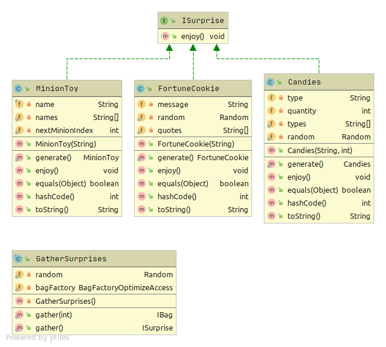
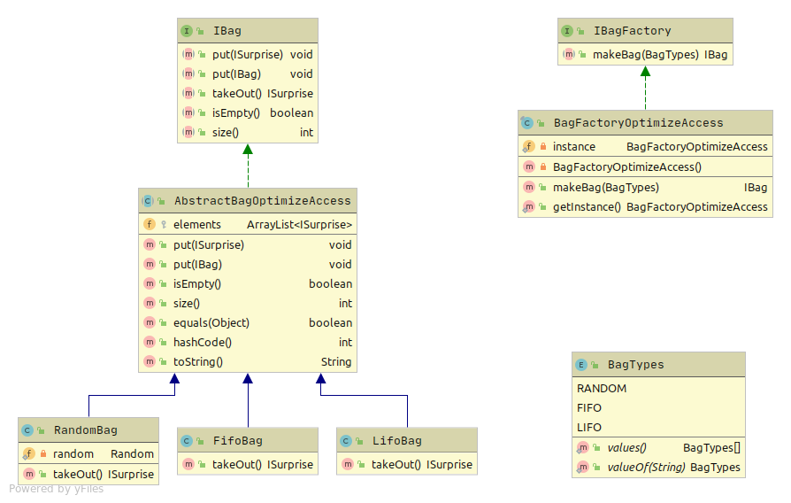
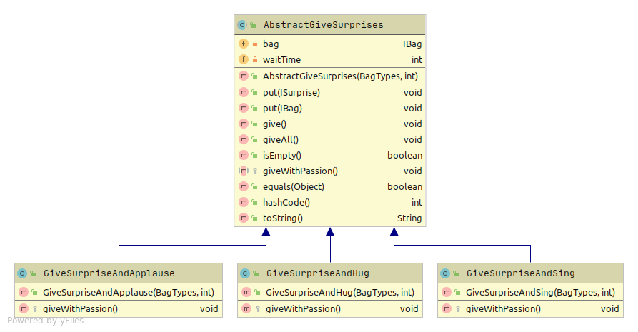

# Aplicatie 'Imparte surprize'

Acest proiect are drept scop proiectarea unei ierarhii de clase intr-un mod generic, care sa permita definirea unor
componente noi sau actualizarea celor existente cu usurinta, intr-un mod transparent fata de restul aplicatiei.

### 1. Pachetul 'surprise'

Acest pachet contine trei tipuri de surprize (`FortuneCookie`, `Candies` si `MinionToy`) care implementeaza aceeasi interfata - 
`ISurprise`, ce defineste modul in care o surpriza este 'deschisa'. In restul aplicatiei, surprizele sunt folosite prin
intermediul interfetei, ceea ce permite extinderea cu usurinta a aplicatiei prin adaugarea de noi surprize, cat si
gestionarea tuturor surprizelor dintr-o perspectiva comuna.

Fiecare clasa care reprezinta o surpriza contine o metoda statica `generate()` care genereaza in mod aleator o surpriza
de acel tip. Clasa `GatherSurprises` genereaza prin intermediul metodelor supraincarcate o surpriza aleatoare `gather()`
sau un numar de surprize aleatoare `gather(int)`.

### 2. Pachetul 'bag'

Toate surprizele sunt depozitate in containere care implementeaza interfata `IBag`. Aceasta interfata comuna va permite:
1. definierea unor noi tipuri de containere
2. utilizarea unei noi implementari fara schimbari majore in codul sursa

Interfata `IBag` este implementata direct de catre clasa abstracta `AbstractBagOptimizeAccess`, care stocheaza toate 
elementele intr-un ArrayList, optimizand in acest mod accesarea elementelor. Clasa implementeaza toate metodele din 
interfata, cu exceptia metodei `takeOut()`, deoarece implementarea acesteia depinde de tipul containerului. Astfel, clasa 
abstracta este extinsa de trei clase,  care definesc trei containere, corespunzatoare diferitelor metode de a extrage 
elementele din acestea (in ordine aleatoare, FIFO sau LIFO).

Deoarece exista mai multe tipuri de containere, am folosit Factory Pattern, creand in acest mod fabrici de containere.
La acest moment, exista doar o fabrica pentru crearea tuturor containerelor care au la baza un ArrayList. Insa,
definirea unor noi fabrici poate fi realizata usor datorita interfetei `IBagFactory`, care trebuie implementata de
fiecare fabrica.

### 3. Packetul 'giver'

Clasa de baza pentru impartirea surprizelor este `AbstractGiveSurprises`. Aceasta are baza un container din care este
posibila extragerea uneia sau a mai multor surprize. Pentru a defini diferite actiuni care pot fi efectuate dupa 
oferirea surprizei (aplauze, cantec, imbratisare), clasa de baza este extinsa de trei clase, care suprascriu metoda
`giveWithPassion()`, apelata imediat dupa oferirea surprizei.

